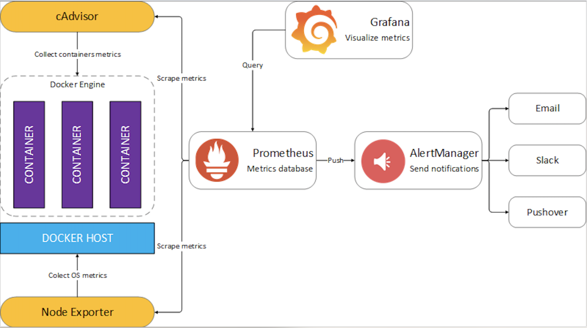
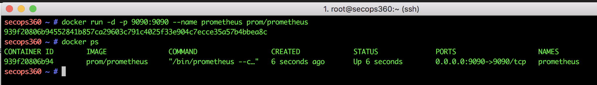
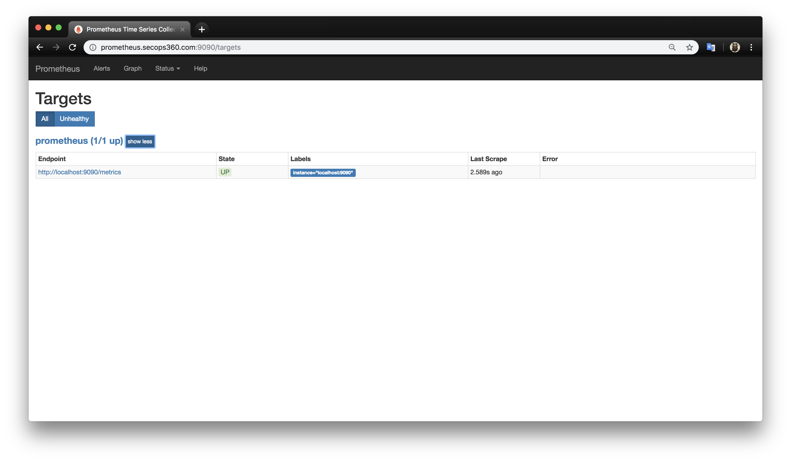
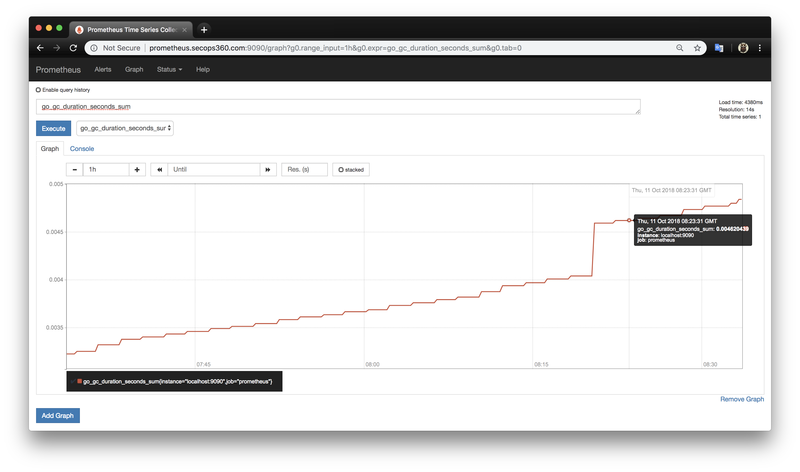

# Giriş

Bu yazıda Prometheus'un ne olduğunu açıklayarak, hangi dilde yazıldığını ve hangi ihtiyacı karşılama amacı ile geliştirildiğini, alternatif uygulamalara göre avantajlarını ele alıp docker ortamında prometheus kurulumu yapılacaktır. Sonraki adımlarda ise Prometheus ekosistemine ait bileşenleri ela alıp bu sistem ile birlikte kullanılan zengin görsel yeteneklere sahip metrik analiz paketi olan **Grafana** ve **Alert Managerden** bahsedilecektir.


####  Prometheus nedir ve hangi dilde yazıldı...
Prometheus, Google 'in [**Bormon**](https://landing.google.com/sre/book/chapters/practical-alerting.html) Monitoring uygulamasından esinlenerek, **Go** dilinde yazılmış popüler _Açık Kaynak Kodlu_ sistem izleme, uyarı ve _zaman serili veritabana sahip_ _yeni nesil Monitoring sistemidir_.
> Prometheus Next-Generation Monitoring System, Open-Source, Time-Series Database,

Özetle, 2012-2013 yıllarında SoundCluod firması Prometheus projesine başladı ve 2015'in başlarında halka açıldı. Prometheus'un Go dilinde yazıldığını belirtmiştik. Doğru bir ifade olması açısından çoğu bileşeni Go dilinde, bazı bileşenleri ise Java, Pyhton ve Ruby'de yazıldığını belirtmekte yarar var. Prometheus, *Apache 2.0 Lisansı* altında yayınlanmıştır. Şuan bağımsız Open-Soruce projesi olup çok sayıda geliştiricisi ve kullanıcı topluluğu bulunmaktadır. 2016 yılında _Cloud Native Computing Foundation_ katıldı.


### Prometheus neden ortaya çıktı ve kimler tarafından yazıldı...
SoundCloud firması momolotic yapıdan _microservice_ mimarisine geçiş aşamalarında mevcutta kullandıkları Monitoring uygulamaları (StatsD ve Grafite...) yetersiz gelmeye başlamış durumdaydı. Firmanın ihtiyacları belliydi ve bu ihtiyaçlar çeşitli sistemlerde mevcuttu.  2012-2013 yıllarında bu özellikleri tek bir üründe toparlama kararı alınıp  Matt T. Proud ve Julius Volz tarafından projeye başlanmıştır. Böylece `Her şeyi ve her katmanı, aynı sistemle izleyebilen` Prometheus doğmuştur. Her katmandan kasıt, network katmanı, fiziksel host katmanı, docker katmanı, uygulama katmanı vs.. her bir seviye için halı hazırda Prometheus'un **exporter** adı verilen propları bulunmakta. Yeri gelince bu bileşenlerden detaylı bir şekilde bahsediyor olacağız.

SoundCloud firması microservise mimarisine geçişi esnasında ihtiyaç duyduğu özelliker ise aşağıdaki gibidir.

- **A multi-dimensional data model.** (Çok boyutlu veri modeli) 
Verinin ihtiyaca göre ayrışmasının sağlanması. instance, service, endpoint, method vs.

- **Operational simplicity.** (Operasyonel basitlik)
Yerel iş istasyonları bile istenilen yer ve zamanda Monitoring sunucusuna kolayca cevrilebilme.

- **Scalable data collection and decentralized architecture.** (Ölçeklenebilir veri toplama ve merkezi olmayan mimari)
Farklı ekipler bağımsız Monitör sistemi kurabilir ve servisleri güvenilir bir şekilde izleyebilmeliler.

- **A powerful query language.** (Güçlü bir sorgulama dili.)
Anlamlı uyarılar, grafikler ve sorgular oluşturabilmek için özel data modeli kullanmalı.  

### Neden Prometheus?
- A Monitoring and alerting system for distributed systems and infrastructure (Dağıtılmış sistemler ve altyapı için bir izleme ve uyarı sistemidir)
- Highly  scalable (Yüksek ölçeklenebilirlik)
- Highly  available (Yüksek erişebilirlik)
- Minimal  external  dependencies (Minimum dış bağımlılıklar)
- Easy  deployment (Kolay dağıtım)
- Lots  of  existing  integrations (Çok sayıda mevcut entegrasyon )
- Extensive  documentation (Kapsamlı dokümantasyon)
- Commercial  support  available (Ticari destek mevcut)
- Designed  with  microservices  and  distributed  architectures  in  mind (Mikro-Makro servis için uygun olması)
- Not a long-term archival system (Uzun vMonitoringadeli arşiv sistemi değildir)
- Bussiness intelligence reporting system. (Raporlama aracı değildir)
- Not a data-mining backend. (Veri madenciliği backend 'inde kullanılmaz)

Prometheus'un Nagios, Sensu, Graphite, InfluxDB ve OpenTSDB ile detaylı karşılaştımalarını  [bu likten](https://prometheus.io/docs/introduction/comparison/) inceleyebilirsiniz.

### Prometheus ekosisteminin bileşenleri & "_exporter_" lar.

Her şeyi, her seviyedeki katmanı, aynı sistem ile izlemeyi  mümkün kılan _yeni nesil Monitoring ekosistemi_ olan **Prometheus** için _Official_ veya _Third-party exporters_ bulunmakta. Bu exporter 'lar sayesinde elde edilen metrikler, HDD doluluk oranı, swap kullanımı, ping kaybı, uygulamada ki hatalar veya benzeri istatiksel veriler istenir ise _Alermanager_ yardımıyla email, slack, PagerDuty, Generic Webhooks, OpsGenie, Pushover, HipChat gibi dış servislere gönderimi sağlanabilir. Prometheus 'un _ekosistem_ olarak ifade edilme sebebi uçtan uca tam bir Monitör ve alert sistemi olup dış servisler ile entegre olmasına bağlıyabiliriz. 

Prometheus, monitör edilmesi istenilen sunuculardaki, HTTP endpointlerinden kazıdıkları metrikleri toplar ve depolar. Bu özelliği ile yani HTTP üzerinden verilerin çekilmesi Prometheus'a bir dizi avantajlar sağlar ve diğer Monitoring ve alerting sistemlerinden farklı kılar. Kısacası monitör edilen kaynaklardan verileri gönderme (_push_) yerine, Prometheus monitör edilen kaynaklardan verileri çeker (_pull_). _Prometheus is pull-based Monitoring system..._
Bazen kaynaklardan veri çekme yerine göndermemiz de gerekebilir. Bu durumlar için Prometheus'un __PushGateway__ exporter 'dan yararlanabiliriz. 
İleride  PushGateway ve push metriklerinden detaylı bir şekilde bahsedeceğiz.

 [Monitör everything, all levels, with the same system. ](https://devops.jaxlondon.com/wp-content/uploads/2016/05/Monitoring-a-Kubernetes-backed-microservice-architecture-with-Prometheus_Fabian-Reinartz-Bj%C3%B6rn-Rabenstein.pdf)


| Katman-Seviye |Neyi Monitör Eder veya Niçin Kullanılır | Kullanılan Exporter
:-------|:----------------------------|----------------------------|
|Network|Router, switch, acces point, modem  vs.. |SNMP-Exporter|
|Host, OS, Hardware|OS, Donanım, kaynakları bilgileri.. cpu, ram, hdd|Node-Exporter |
|Uygulama|Latency, errors, QPS, internal state|PushGateway|
|Container|Kaynak kullanımı ve container performans değerleri |cAdvisor|
|Orchestration|Cluster kaynakları, scheduling|Kubernetes components|


Exporter ile ilgili daha fazla bilgi ve detay için [burayı](https://prometheus.io/docs/instrumenting/exporters/) tıklayın.



<!-- 
### Prometheus desteklediği metrik türleri:
- Counter, **Sayaç** is a cumulative metric that represents a value that only ever goes up, like a request count.
- Gauge, **Ölçme** is a metric that represents a value that can arbitrarily go up and down, like a temperature or a queue length.
- Summary, **Özet** (summary) is a client-side calculated histogram of observations, usually used to measure request durations or sizes.
- Histogram samples observations (usually things like request durations or response sizes) and counts them in configurable buckets. It also provides a sum of all observed values. A histogram with a base metric name of <basename> exposes multiple time series during a scrape:
-->


### Prometheus kurulumu ve ayarları.
Promethe'us kurulumu çok basit olmasına rağmen config dosyasını doğru şekilde ayarlamalı ve amacımıza hizmet etmesi sağlamalıyız. Prometheus'un ayar dosyası _yml_ uzantılı yani **yaml** dosya formatındadir.  Docker ortamında Prometheus ayağı kaldırdığımızda varsayılan prometheus config dosyası aşağıdaki gibidir. Prometheus'un config yml dosyasını kendimiz oluşturup daha sonrasında bu dosyayı güncelleyeceğimiz için docker ortamında **Volumes & Bind-Mount** özelliğini kullancağız.
Prometheus varsayılan olarak 9090 portundan çalışır ve 15 günlük datayı üstünde tutar. Bu gibi ayarları değiştirmek için Prometheus sunucusunda "**./prometheus -h**" komutunu kullanarak istenilen ayarları güncelleyebiliriz.

Hızlı bir şekilde container ortamında prometheus'u ayağı kaldırıp kurmak için komut:

```bash
docker run -d --name prometheus -p 9090:9090 prom/prometheus
```

Volumes & bind-mount ile kalıcı config dosyası ile kurulum için komut:

```bash
docker run -d --name prometheus -p 9090:9090 \
       -v /mnt/Monitoring/prometheus:/etc/prometheus \
       prom/prometheus --config.file=/etc/prometheus/prometheus.yml
```



Kurulumu yaptıktan sonra **_`http://ServerIp:9090/`_** şeklinde prometheus 'a giriş yapabiliriz. **Targets** kısmında ise **Endpoint** 'lermizin durumlarını **_UP_** olarak görmemiz gerekiyor.




Promethues'un `YAML` dosyasını biraz daha incelemekte yarar var. Aşağıdaki config dosyasında `global`, varsayılan ayarları belirlememizi sağlar.
`scrape_interval`, metrikleri kazıma aralık süresini, `evaluation_interval` ise  hesaplama, değer aralık süresini belirler.

>prometheus.yml

```yaml
# my global config
global:
  scrape_interval:     15s # Set the scrape interval to every 15 seconds. Default is every 1 minute.
  evaluation_interval: 15s # Evaluate rules every 15 seconds. The default is every 1 minute.
  # scrape_timeout is set to the global default (10s).

# Alertmanager configuration
alerting:
  alertmanagers:
  - static_configs:
    - targets:
      # - alertmanager:9093

# Load rules once and periodically evaluate them according to the global 'evaluation_interval'.
rule_files:
  # - "first_rules.yml"
  # - "second_rules.yml"

# A scrape configuration containing exactly one endpoint to scrape:
# Here it's Prometheus itself.
scrape_configs:
  # The job name is added as a label `job=<job_name>` to any timeseries scraped from this config.
  - job_name: 'prometheus'

    # metrics_path defaults to '/metrics'
    # scheme defaults to 'http'.

    static_configs:
    - targets: ['localhost:9090']
```

Konfigirasyon dosyası olarak bu örnekte sadece `static_config` kullandık. Bunun dışındaki configler ise aşağıda sıralanmış ve kısaca açıklanmıştır. 


-  `<static_config>`: En yaygın kullanılan ayar parametrisidir. İzlenecek sunucunun ip, port vs. bilgileri statik olacak girilir.

-  `<tls_config>`: TLS bağlantısı yapabilmemiz için gerekli bilgileri girmemizi sağlayan parametredir. _Transporter Layer Security_ yani iki bilgisayar arasında ki iletişim güvenli bir katman üzerinden gerçekleşmesini sağlayan protokoldür. 

-  `<file_sd_config>`: En yaygın kullanılan diğer bir parametredir. Statik veya "Service Discovery" ile  izlenecek hedefleri bulan bir mekanizmadır. JSON dosya uzantılı olmaladır.

-  `<gce_sd_config>`: Google Cloud Platform üzerindeki projemizin izleneme bilmesi adına bilgi ve ayarların girilebileceği parametredir.

- `<ec2_sd_config>`: AWS EC2 'yi Monitör hesabımızı izlemek için gerekli bilgilerin giribileceği parametredir.

- `<alertmanager_config>`: Monitör ettiğimiz sistemlerden aldığımız uyarıları göndereceğimiz sistemlerin veya servislerin bilgilerini girebilmemiz için gerekli parametredir. 

Azure, Kubernetes, OpenStack ve Conlus gibi bir çok hizmeti veya servisi Monitör edebilmemiz için gerekli config parametresi bulunmaktadır. Detaylı bilgiye ise [buradan](https://prometheus.io/docs/prometheus/latest/configuration/configuration/#%3Cstatic_config%3E) ulaşabilirsiniz.

```
<kubernetes_sd_config>
<openstack_sd_config>
<azure_sd_config>
<consul_sd_config>
<dns_sd_config>
<file_sd_config>
<marathon_sd_config>
<nerve_sd_config>
<serverset_sd_config>
<triton_sd_config>
<relabel_config>
<metric_relabel_configs>
<alert_relabel_configs>
<alertmanager_config>
<remote_write>
<remote_read>
<scrape_config>
```
